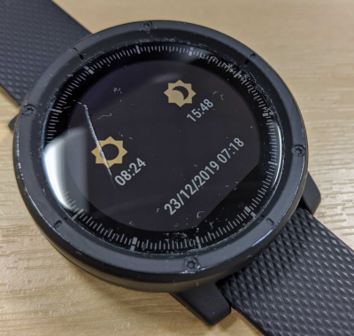
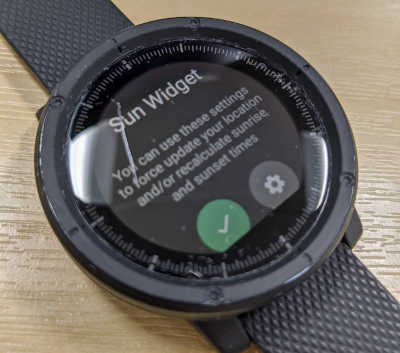

# Amazfit Sun Widget

My attempt at a very minimal sunrise and sunset time calculator

## Features
- This is a Pace/Stratos/Verge Widget
- Shows sunrise and sunset times in UTC with last update timestamp
- Simple settings interface to fetch new location (only required if moved a large distance) and force time recalculation
- Background updating

## Bugs / To Do
- Display calculated times in your local timezone
- Display location where times were calculated
- You tell me!

## Downloads
Get it from:
- [Github Releases](https://github.com/Sykomaniac/Amazfit-Sun-Widget/releases/latest)
- Compile your own version with Android Studio.

## Installation
To install this widget, you will need a PC with the ADB installed. Connect your Amazfit on your PC and fire up a terminal.

```shell
adb install -r Amazfit-Sun-Widget-1.0.apk
adb shell am force-stop com.huami.watch.launcher
```

To uninstall:

```shell
adb uninstall com.sykomaniac.sunwidget
```

## Usage
1. Install app and restart springboard
1. Ensure that your watch has a set location
 * If you haven't set a location on your watch open the Location app and a new location
1. Open up the settings app (labelled Sun Widget) from the app list
1. Click on the settings icon
1. Click "Update Location" which will fetch the last known location and store it for use by the app
  * **The widget will display "N/A" until you save a location**
1. Optionally click on "Refresh Times" action to update the calculated widget times


## Screenshots




### Special thanks
A special thanks to all of the following who's code this project uses/is inspired by:
- GreatApo - General widget help - [ [Github](https://github.com/GreatApo) | [XDA](https://forum.xda-developers.com/member.php?u=3668555) ]
- Quinny899 - Settings design & general awesomeness - [ [Github](https://github.com/KieronQuinn) | [XDA](https://forum.xda-developers.com/member.php?u=3563640) ]
- Raptik - Shared preferences API [ [GitHub](https://github.com/ratpik/android-sharedpreferences-api) ]
- Caarmen - Sunrise & sunset calculation - [ [GitHub](https://github.com/caarmen/SunriseSunset) ]
